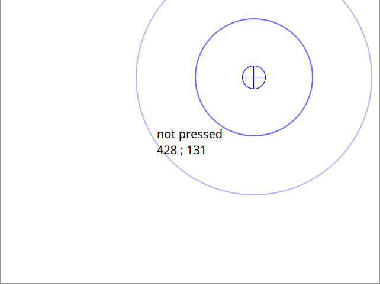

# qt-touchscreen-test
Simple touchscreen graphical test application, in Qt QML.

This application will:

* Show a visual and text indication when touchscreen is pressed (red) and released (blue)
* Indicate coordinates on the GUI in the standard output

## Usage example

Simply run the application with your preferred with backend `--platform <platform>`.

```
qml: Released at  353 ; 217
qml: Pressed at   353 ; 217
qml: Clicked at   353 ; 217
qml: Released at  428 ; 131
qml: Pressed at   428 ; 131
qml: Clicked at   428 ; 131
```


